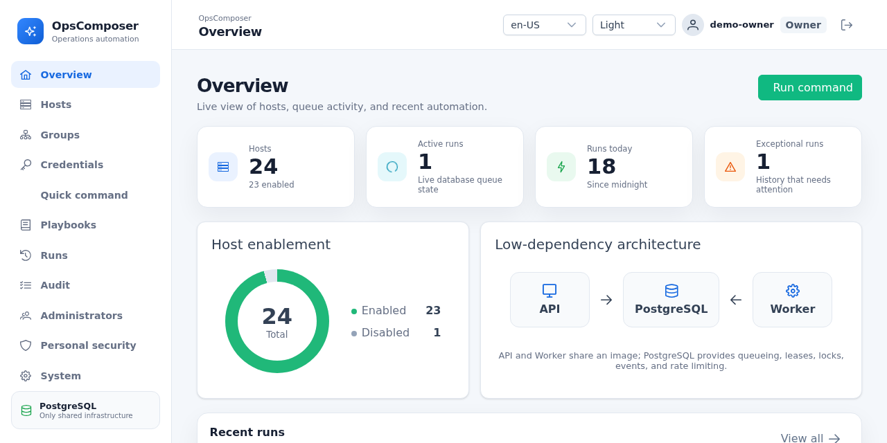
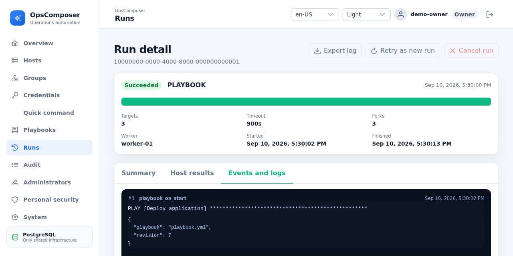

# OpsComposer

[简体中文](README.zh-CN.md) | English

**From SSH to governed Ansible operations.**

OpsComposer gives small operations teams one self-hosted place to run Ansible, handle interactive
SSH incidents, share access safely, and answer who did what. It packages OpenSSH and Ansible Runner
into a governed web workflow without requiring Kubernetes or a separate message broker.

[](https://github.com/yernsun/ops-composer/releases/tag/v0.1.0)
[](https://github.com/yernsun/ops-composer/actions/workflows/ci.yml)
[](CONTAINER.md)

[Try locally](#local-evaluation) ·
[Deploy with Compose](#production-compose) ·
[Explore features](#features) ·
[Compare options](#where-it-fits) ·
[Read the docs](#documentation)



## Features

### Compose-friendly deployment

- Four production services: PostgreSQL 16, a one-shot migration, API, and Worker.
- PostgreSQL is the only infrastructure dependency for business data, the durable queue, leases,
  host locks, replayable events, audit records, and authentication rate limits.
- No Redis, Celery, Kafka, object storage, or standalone Nginx service. The API serves the compiled
  Vue application; your reverse proxy owns TLS.
- One release image runs the API, Worker, migration, and CLI on `linux/amd64` and `linux/arm64`.

### Host operations

- Run Ping, Command, explicitly confirmed Shell, or Playbooks against hosts and groups.
- Manage multi-file Playbooks in PostgreSQL or use a read-only mounted Playbook workspace.
- Open a full-screen xterm.js Web Shell for interactive incident response.
- Use PASSWORD or SSH_PRIVATE_KEY credentials without exposing plaintext through API responses.

### Team governance

- Four fixed roles: `OWNER`, `ADMIN`, `OPERATOR`, and `AUDITOR`.
- Invite teammates with short-lived activation codes; protect accounts with TOTP and one-time
  recovery codes.
- Require recent password plus MFA reauthentication for sensitive administration.
- Scan SSH host keys, show fingerprints, and require a human confirmation before first use.

### Reliable execution

- Freeze target, inventory, credential revision, Playbook revision, and content hashes when a Run
  is created.
- Claim work from a PostgreSQL durable queue with Worker leases and per-host locks.
- Cancel long work, enforce timeouts, recover interrupted leases, and retry as a new traceable Run.
- Persist ordered Run events and replay them over SSE after a browser reconnects.

### Security and audit

- Encrypt immutable credential revisions with AES-256-GCM and rotate versioned Keyring keys online.
- Consume sensitive Playbook parameters once; keep them out of snapshots, responses, logs, audit,
  and Run events.
- Emit single-line structured logs and retain immutable business audit events in PostgreSQL.
- Search and export audit history from the UI, with a controlled CLI for offline administration.



## Quick start

### Local evaluation

Use the development Compose stack to explore OpsComposer on one machine:

```bash
cp .env.dev.example .env.dev
docker compose --env-file .env.dev -f docker-compose.dev.yml up -d --build
docker compose --env-file .env.dev -f docker-compose.dev.yml \
  exec api ops-composer admin bootstrap --username admin
```

Open <http://localhost:5173>.

> This stack is for development and evaluation only. Its services bind to loopback and its defaults
> are not production secrets. Do not place real credentials or production data in it.

### Production Compose

Production uses the published multi-architecture image. Persist the image name and deployment
settings in `.env` so every Compose invocation resolves the same configuration:

```bash
cp .env.example .env
```

Edit `.env` and set at least:

```dotenv
OPS_COMPOSER_IMAGE=ghcr.io/yernsun/ops-composer:v0.1.0
POSTGRES_PASSWORD=<strong-random-password>
DATABASE_URL=postgresql://ops_composer:<url-encoded-password>@db:5432/ops_composer
APP_ALLOWED_ORIGINS=https://ops.example.com
APP_AUTH_RATE_LIMIT_SECRET=<64-hex-characters>
FORWARDED_ALLOW_IPS=<trusted-reverse-proxy-addresses>
OPS_COMPOSER_MASTER_KEYRING_FILE=/run/secrets/ops-composer-keyring/keyring.json
```

Create and back up the versioned Keyring file, configure deployment-owned HTTPS, then validate and
start the stack:

```bash
docker compose --env-file .env config
docker compose --env-file .env pull
docker compose --env-file .env up -d --no-build
docker compose --env-file .env exec api \
  ops-composer admin bootstrap --username admin
```

Configure exactly one master-key mechanism. For Keyring creation and rotation, TLS and WebSocket
proxying, digest pinning, SBOM, provenance, backups, and upgrades, follow the
[container deployment guide](CONTAINER.md) and [operations FAQ](FAQ.md).

## How it works

```text
Browser -- REST / SSE --> API ------> PostgreSQL <------ Worker
Browser -- WebSocket --> API                              |
                           \-- OpenSSH PTY --> Host        \-- Ansible Runner -- SSH --> Hosts
```

PostgreSQL joins queue state, immutable execution snapshots, Worker leases, per-host locks,
replayable events, and audit records in shared transaction boundaries. Web Shell is intentionally
not a replayable Run and never stores terminal content, but it shares the same per-host lock so an
interactive session cannot race an automation Run.

## Where it fits

### Bare SSH vs CLI Ansible vs OpsComposer

| Concern | Bare SSH | CLI Ansible | OpsComposer |
| --- | --- | --- | --- |
| Team access | Individual accounts, keys, and shell history | Shared only through your existing control-node, repository, or CI practices | Shared web console with fixed roles, account lifecycle, TOTP, and sensitive-operation reauthentication |
| Batch and repeatable work | Manual scripting | Strong declarative and ad-hoc automation | Ansible execution with immutable Run snapshots and retry-as-new history |
| Credentials | Local key files, agents, or copied secrets | Inventory, Vault, agents, or external secret tooling | Encrypted, versioned credential revisions with controlled assignment |
| SSH host keys | OpenSSH `known_hosts`, usually managed per operator | Depends on control-node configuration | Fingerprint scan, human confirmation, strict temporary `known_hosts` per Run or Shell |
| Concurrent protection | No shared coordination | Parallel forks, but no cross-operator host lock by default | PostgreSQL per-host lock shared by Runs and Web Shell |
| Logs and audit | Local shell history and server logs | Console output, callbacks, CI, or external tooling | Structured service logs plus searchable, exportable business audit and replayable Run events |
| Interactive emergency work | Native strength | Not the primary workflow | Full-screen Web Shell with lifecycle audit and no terminal-content persistence |
| Setup cost | Almost none beyond SSH access | Maintain a control node, inventory, dependencies, and conventions | Four Compose services; PostgreSQL is the only infrastructure dependency |

OpsComposer does not replace OpenSSH or Ansible. It operationalizes both for a team by adding shared
access, safe defaults, durable execution, concurrency control, and an audit trail.

### Established alternatives

| Project | Focus | Typical self-hosted deployment | Team and execution strengths | Best when |
| --- | --- | --- | --- | --- |
| **OpsComposer** | Governed Ansible operations plus interactive SSH | Docker Compose: PostgreSQL, migration, API, Worker | Fixed RBAC, host-key approval, durable Runs, per-host locks, Web Shell, audit | A small team is outgrowing personal SSH or Ansible CLI, but does not need a full automation platform |
| [AWX](https://github.com/ansible/awx) | Full Ansible automation controller | Kubernetes through the [AWX Operator](https://docs.ansible.com/projects/awx-operator/en/latest/installation/basic-install.html) | Inventories, credentials, projects, schedules, workflows, RBAC, broad controller features | Ansible is a strategic platform and Kubernetes operations are acceptable |
| [Semaphore UI](https://github.com/semaphoreui/semaphore) | Lightweight multi-tool automation UI | Container, package, Snap, or binary; see [installation options](https://docs.semaphoreui.com/administration-guide/installation) | Task templates, repositories, environments, teams, schedules, and multiple automation tools | You want a compact UI and scheduling across Ansible and adjacent tools |
| [Rundeck](https://github.com/rundeck/rundeck) | General self-service Runbooks and workflows | Packages, Docker, or Kubernetes; see the [installation guide](https://docs.rundeck.com/docs/administration/install/) | Job workflows, plugins, scheduling, access policy, and self-service operations | The workflow spans many systems and is broader than Ansible |
| [OliveTin](https://github.com/OliveTin/OliveTin) | Web buttons for predefined shell actions | Single server/container with configuration; see [Docker Compose](https://docs.olivetin.app/install/docker_compose.html) | Simple, approachable action dashboard with access controls | You mainly need safe, predefined command buttons rather than an Ansible control plane |

The comparison reflects community/open-source capabilities and official self-hosting
documentation; commercial editions may differ.

### A good fit

- Small and medium operations teams moving from personal SSH or Ansible CLI to shared governance.
- One Compose deployment where PostgreSQL-backed durability is preferable to more infrastructure.
- Environments that need repeatable automation and a tightly controlled interactive escape hatch.
- Teams that value host-key confirmation, encrypted credentials, concurrency protection, and
  queryable audit history.

### Not the right fit yet

Choose a more complete platform when you require high availability or horizontal scaling,
SSO/LDAP/OIDC, scheduled jobs, approval workflows, multi-tenancy, a full CMDB or monitoring suite,
or a broad GitOps/application-deployment system. OpsComposer keeps these boundaries explicit
instead of presenting partial implementations as production-ready features.

## Security and operational trust

- SSH connections require manually confirmed host keys and strict checking.
- Credential plaintext is confined to controlled execution paths; runtime directories are `0700`,
  temporary files are `0600`, and cleanup runs after success, failure, or recovery.
- Web Shell tickets are single-use and short-lived. Terminal input, output, and recordings are not
  persisted; safe lifecycle metadata is audited.
- Playbooks are trusted code. Mounted sources are read-only and path-confined; database projects
  have restricted files, immutable revisions, deterministic import/export, and pinned execution.
- Production operators own HTTPS termination, proxy trust, database backups, Keyring backups, and
  audit-retention policy.

See the [security design](docs/ops-composer-design.md), [container deployment guide](CONTAINER.md),
and [security reporting policy](SECURITY.md) before exposing a deployment.

## Documentation

- [Product, data, and security design](docs/ops-composer-design.md)
- [Container deployment, verification, SBOM, and upgrades](CONTAINER.md)
- [Operations FAQ and recovery procedures](FAQ.md)
- [Architecture and engineering guide](docs/README.md)
- [Security reporting](SECURITY.md)
- [Support and sponsorship policy](SUPPORT.md)
- [Professional services](COMMERCIAL_SERVICES.md)
- [Contributing](CONTRIBUTING.md)

## Development and contributing

The development Compose stack supports the normal edit-and-refresh workflow:

```bash
cp .env.dev.example .env.dev
docker compose --env-file .env.dev -f docker-compose.dev.yml up --build
```

Before submitting a change, run the repository gate:

```bash
python3 harness/check.py
```

Read [AGENTS.md](AGENTS.md), the [architecture rules](docs/README.md), and
[CONTRIBUTING.md](CONTRIBUTING.md) before changing application behavior. PostgreSQL integration,
Compose, and real OpenSSH acceptance checks are opt-in and documented with the relevant test
stacks.

## Project Forge provenance

The repository was upgraded from exact upstream Project Forge commit
[`a36fb96d`](https://github.com/yernsun/project-forge/commit/a36fb96da3780b4bb8086cbbdb803e08ec163457)
with `fullstack + auth + no-evented + no-sample + zh-CN`. The installed generator version is
`0.3.0`; the recorded template digest is
`sha256:b500ef54df5fbbfb8daa010123aa5bda70d8d11fbb6b75de075b27a3e1e5d159`.
Generator metadata, `.project-forge.yml`, and the template baseline are preserved for reproducible
upgrades.

## Support and funding

Community support is best-effort and has no SLA. Voluntary funding does not buy support, services,
an AGPL exception, or a commercial license. Deployment, migration, and security-hardening services
may be separately priced only under a written agreement; a commercial software license is not
currently offered.

- [Get community support](SUPPORT.md)
- [Fund general maintenance through PayPal](https://www.paypal.me/yernsun) — verify the PayPal.Me
  profile before paying
- [Discuss paid professional services](COMMERCIAL_SERVICES.md)
- [Report a security issue](SECURITY.md)
- [Review the CLA readiness policy](CLA_POLICY.md)

The CLA process is not active. Until its legal recipient, final terms, privacy notice, and
acceptance records are operational, external copyrightable contributions must not be merged.

## License

OpsComposer project-authored code is released under the GNU Affero General Public License version
3 only (`AGPL-3.0-only`). The exact terms in [LICENSE](LICENSE) control. Organizational and
commercial use is permitted under that license; distribution and modified network deployments may
trigger source-code and notice duties, including the section 13 offer of Corresponding Source to
remote users.

Third-party components remain under their own licenses. Review [NOTICE.md](NOTICE.md),
[THIRD_PARTY_NOTICES.md](THIRD_PARTY_NOTICES.md), and the
[dependency compliance notes](docs/legal/dependency-compliance.md) before distributing an image.
